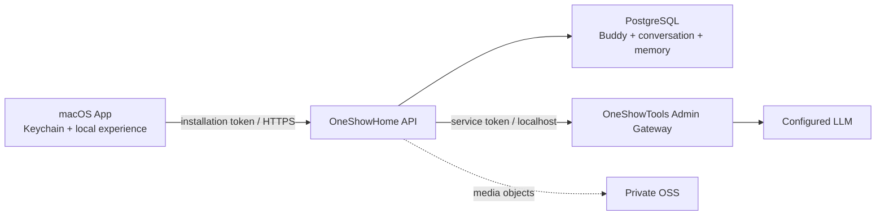

# ADR 0003：本地生活体验 + 联网陪伴服务

- 状态：Accepted
- 日期：2026-08-11
- 影响范围：macOS 客户端、AI 对话、用户数据、Admin、部署
- 补充：本决策扩展 ADR 0002，不取消断网时的小屋与 Buddy 基础体验

## 背景

OneShow Home 最初以纯本地 MVP 为目标。产品进入可下载测试阶段后，需要解决三个问题：

1. 模型密钥不能随 App 分发，也不能让每位用户自行配置；
2. 运营者需要在现有 OneShowTools Admin 中测试、切换和停用模型；
3. 用户的 Buddy、对话和未来的头像、相册、语音需要可治理的服务端存储。

## 决策

采用“本地生活体验 + 联网陪伴能力”的混合架构。

- 桌面小屋、进入 Home、基础状态展示和动效不依赖网络；
- AI 对话经 OneShowHome API 发起；
- OneShowHome API 保存安装身份、Buddy 资料、会话、消息和记忆；
- 模型密钥由 OneShowTools Admin 加密保存，OneShowHome API 只调用内部模型网关；
- 安装令牌是 256 bit 随机值，服务端只保存 SHA-256 摘要，明文保存在 macOS Keychain；
- PostgreSQL 保存结构化用户数据；OSS 仅保存头像、相册、语音等对象；
- App 内不包含模型、数据库或 OSS 密钥。

## 数据权威边界

| 数据 | 权威来源 | 断网策略 |
| --- | --- | --- |
| 小屋窗口与动效 | 本机 | 完整可用 |
| 临时 UI 状态 | 本机 | 完整可用 |
| 安装凭证 | macOS Keychain | 可读取，不上传明文 |
| Buddy 账户资料 | PostgreSQL | 使用最近缓存，恢复联网后刷新 |
| 对话与长期记忆 | PostgreSQL | 不伪造 AI 回复，提示稍后重试 |
| 模型配置与密钥 | Admin 加密存储 | 客户端不可见 |
| 头像、相册、语音 | 私有 OSS + PostgreSQL 元数据 | 后续加入上传队列 |

## 安全约束

- 公网只暴露 `https://oneshowhome.com/api/`；数据库、模型网关和 API 进程端口只监听本机；
- Admin 内部网关使用独立的随机服务令牌，并限制为 OneShow Home 模型用途；
- 对话接口按安装限流，正文有长度上限，数据库查询全部参数化；
- 日志只记录请求 ID、错误码、耗时和模型调用元数据，不记录令牌、密钥或完整聊天内容；
- OSS 使用私有 ACL、产品独立前缀和随机对象键。

## 后果

正面影响：模型可以集中治理，密钥不出服务端，用户数据具备备份、删除和未来多端能力。

代价：AI 对话需要网络；服务端成为需要监控、备份和发布治理的正式产品组件。上线前必须补充隐私政策、数据导出与删除流程。
